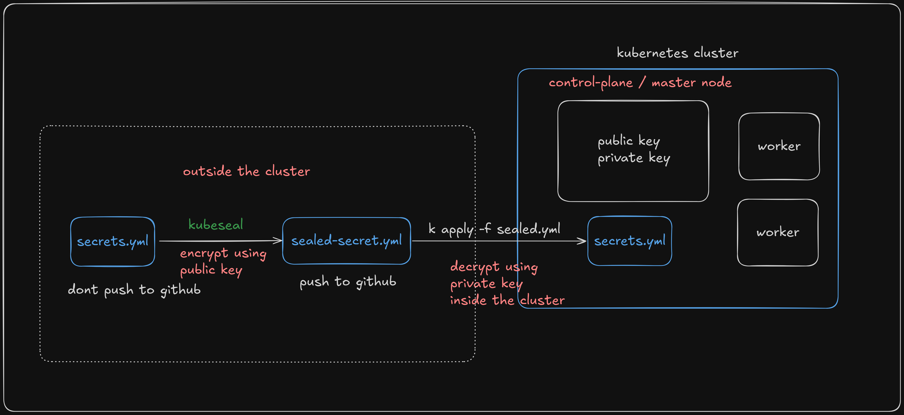

---

### Install the Sealed Secrets Controller

```shell
export KUBESEAL_VERSION="0.23.0"
wget -O kubeseal-${KUBESEAL_VERSION}-linux-amd64.tar.gz \
  "https://github.com/bitnami-labs/sealed-secrets/releases/download/v${KUBESEAL_VERSION}/kubeseal-${KUBESEAL_VERSION}-linux-amd64.tar.gz"
tar -xvzf kubeseal-${KUBESEAL_VERSION}-linux-amd64.tar.gz kubeseal
sudo install -m 755 kubeseal /usr/local/bin/kubeseal
```

---

### Install the kubeseal CLI Tool

#### For Linux
```shell
wget https://github.com/bitnami-labs/sealed-secrets/releases/latest/download/kubeseal-linux-amd64 -O kubeseal
sudo install -m 755 kubeseal /usr/local/bin/kubeseal
```

#### For windows
```shell
choco install kubeseal
```

#### Verify the installation
```shell
kubeseal --version
```

---

### Seal The secret

```shell
cat my-secret.yaml | kubeseal --format yaml > my-sealed-secret.yaml
```

---

### Apply the SealedSecret to the Cluster

```shell
kubectl apply -f my-sealed-secret.yaml
```