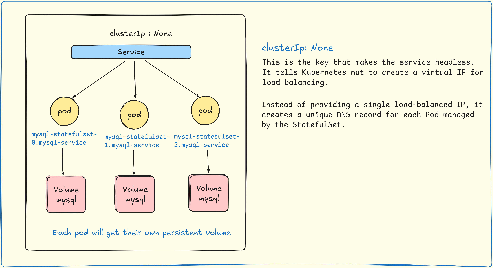
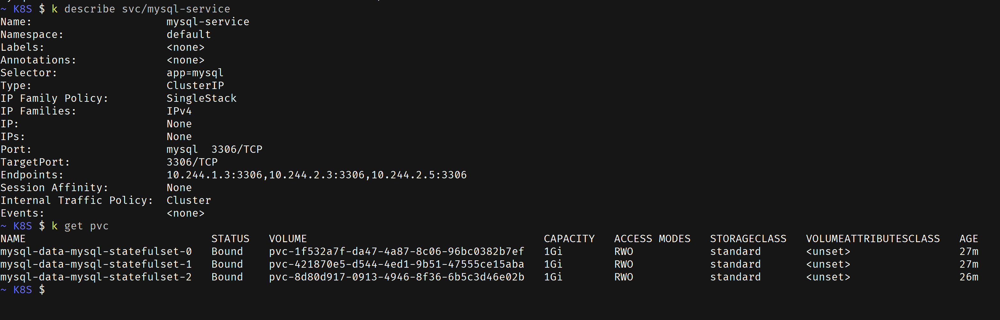

A Kubernetes **StatefulSet** is a workload object used to manage stateful applications, which are applications that need to keep track of their state and require stable, unique identities and persistent storage. It's the go-to controller for running databases like MySQL or PostgreSQL, message queues like Kafka, or any application where the individual instances (Pods) are not interchangeable.

---

## Simple ClusterIp

---

## Headless service

-----

### PersistentVolume
>[!NOTE]
>When mysql-statefulset-0 is created, it will automatically generate a PVC named mysql-data-mysql-statefulset-0.
>
>When mysql-statefulset-1 is created, it will generate a PVC named mysql-data-mysql-statefulset-1.
>
>...and so on.

## Key Features of a StatefulSet

StatefulSets provide critical guarantees that Deployments do not:

  * **Stable, Unique Network Identity**: Each Pod in a StatefulSet gets a predictable and persistent name based on the StatefulSet name and an ordinal index (e.g., `web-0`, `web-1`, `web-2`). This name sticks with the Pod even if it's rescheduled to a different node.
  * **Stable, Persistent Storage**: Each Pod gets its own unique PersistentVolumeClaim (PVC) and associated PersistentVolume (PV). The storage for `web-0` will always be reattached to the Pod named `web-0`, ensuring the Pod always has access to its specific data.
  * **Ordered, Graceful Deployment and Scaling**:
      * **Creation**: Pods are created sequentially, one after the other. `web-1` will not start until `web-0` is running and ready.
      * **Scaling Up**: New Pods are added in ascending order.
      * **Deletion/Scaling Down**: Pods are terminated in reverse order. `web-1` is terminated before `web-0`. This is crucial for applications like databases that need to gracefully shut down cluster members.
  * **Ordered, Automated Rolling Updates**: When you update a StatefulSet's configuration (e.g., the container image), Pods are updated in reverse ordinal order (`web-2`, then `web-1`, then `web-0`). The update for the next Pod doesn't begin until the current one is successfully updated and ready.

-----

